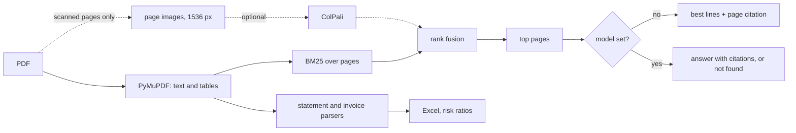

# FinSight AI

Ask questions about financial PDFs and get answers with page citations. Runs locally on open models.


*The GIF is a drawn terminal made from real `finsight ask` output on the CPU-only path (no model). See "Results" for how that path scores.*

[](https://github.com/mfh-001/FinSight-AI/actions/workflows/ci.yml)
[](https://huggingface.co/spaces/MFH-001/FinSight-AI)
<!-- add the license badge here once a LICENSE file is added -->

```bash
pip install "finsight-ai[app] @ git+https://github.com/mfh-001/FinSight-AI.git"
finsight ingest ./my-pdfs
finsight ask "What was total revenue last year?"
```

[Demo](https://huggingface.co/spaces/MFH-001/FinSight-AI) | [Docs](docs/) | [Benchmarks](#results)

## What it does

You give it PDFs (annual reports, invoices, bank statements, contracts). You get:

- **Answers with the page they came from**, like `[apple-10k-fy2023.pdf p.40]`. If the documents do not say, it answers "not found in the documents".
- **Extraction to Excel** for income statements, balance sheets, cash flow, invoices and bank statements. Numbers are plain numbers with a unit and currency. Missing values are empty, not the word "null".
- **A risk check** with the same 8 points as the first version (liquidity, margins, growth, debt, cash flow, anomaly, missing data, inconsistency). The ratios are computed in code from the extracted numbers. Each flag shows the numbers and the page. A model, if you set one, only writes the summary.

Everything can run on your own machine or server. No paid APIs. Nothing is sent anywhere unless you point it at a remote model server.

For Apple's FY2023 10-K it reports revenue fell 2.8% (394,328 to 383,285 million, page 40) and operating margin is 29.8%.
The first version said revenue was growing. That output is kept in `legacy/` and explained in `docs/AUDIT.md`.

## Results

49 questions on two public SEC filings (Apple FY2023 10-K, Nathan's Famous FY2025 10-K): 42 have an answer in the document and 7 do not.
Answers were checked by hand against the filings. Questions, answers and gold pages are in `eval/questions.jsonl`.
Run it yourself: `finsight --backend none eval`.

| Config | Exact match | Numeric tolerance | Citation hit | Not-in-doc correct | Median s/question | Hardware | Date |
|---|---|---|---|---|---|---|---|
| Retrieval only (BM25, no model) | 38.1% | 47.6% | 52.4% | 57.1% | 0.01 | Apple M1, 8 GB, CPU | 2026-10-08 |
| Qwen2.5-1.5B-Instruct on CPU, text only | not measured yet (about 200 to 340 s per question, see below) | | | | | Apple M1, 8 GB, CPU | |
| Qwen2.5-VL-3B or 7B (AWQ) via vLLM, with page images | not measured yet | | | | | needs a GPU | |
| Qwen2-VL-7B 4-bit (original baseline) with ColPali v1.2 | not measured yet | | | | | needs a GPU | |

Other numbers from the same run: the right page was in the top 4 results for 95.2% of answerable questions.

How to read this:

- "Exact match" means the gold value appears as printed. "Numeric tolerance" accepts the same number in other units (for example $383.3 billion for 383,285 million) within 0.5%. "Citation hit" means a cited page contains the answer.
- Retrieval only returns the best matching sentences. It is a baseline, not the product. It often finds the right page and prints the wrong line.
- I wrote parts of the answer logic while looking at these questions, so treat the numbers as optimistic. There is no held-out set yet.
- Not measured yet: Qwen2.5-VL-3B and 7B, Qwen2-VL-7B (the original baseline) and ColPali retrieval. This machine has no CUDA GPU. The code paths exist and the same `finsight eval` command measures them on a GPU box.
- Spot check, not a benchmark: Qwen2.5-1.5B-Instruct on the same M1 CPU (bf16) answered "What were Apple's total net sales in fiscal 2023?" with $383.3 billion in 336 s, and correctly said "not found" for a bitcoin question in 198 s. Too slow for CPU use. A GPU or an Ollama or vLLM server is the intended route for written answers.

## How it works



Born-digital PDFs never get turned into images. Text and tables come straight from the file, so numbers are exact.
Page images are only made for scanned pages and for the vision model. Scanned pages are flagged but not read without a vision model.

## Run locally in 5 minutes

```bash
git clone https://github.com/mfh-001/FinSight-AI && cd FinSight-AI
python -m venv .venv && . .venv/bin/activate
pip install -e ".[app]"
finsight serve                       # opens on http://127.0.0.1:7860
```

Command line:

```bash
finsight ingest samples/
finsight ask "What were Apple's total net sales in fiscal 2023?"
finsight extract --schema statements --out apple.xlsx --doc apple-10k-fy2023
finsight extract --schema invoice --doc invoice-synthetic
finsight risk --doc apple-10k-fy2023
```

Add a model for written answers. Any server that speaks the OpenAI chat API works (Ollama, llama.cpp, vLLM):

```bash
ollama pull qwen2.5:3b
finsight --backend openai --model qwen2.5:3b ask "..."      # default URL is http://localhost:11434/v1
```

Or run a model in-process with `pip install -e ".[gpu]"` and `--backend transformers --model Qwen/Qwen2.5-VL-3B-Instruct`.
Docker: `docker compose --profile cpu up` (I could not run Docker on my machine, so this is untested).

## Run on your own server with one 24 GB GPU

```bash
docker compose --profile gpu up -d    # vLLM with Qwen2.5-VL-7B-Instruct-AWQ, plus the app
```

Details, passwords, retention and backups: [docs/DEPLOY_FOR_A_TEAM.md](docs/DEPLOY_FOR_A_TEAM.md).
The GPU profile has not been run by me. The AWQ 7B model should fit in 24 GB, but check it on your card.

## Data handling

- Uploaded or ingested files are copied to a folder on the machine running the app (`FINSIGHT_HOME`, default `~/.finsight`). The web app uses a temporary folder per visitor and deletes it when the session ends.
- Delete them: `finsight delete NAME` or `finsight delete --all`. Set `FINSIGHT_RETENTION_DAYS` to expire old files.
- Nothing leaves the machine except calls to the model endpoint you configure. With no model, or a model on your own network, no text is sent out.
- Downloading a model from Hugging Face the first time is the one network call you may see.

## Configuration

Settings come from environment variables (`FINSIGHT_` plus the name in capitals) or a yaml file (`--config`).

| Setting | Default | Meaning |
|---|---|---|
| backend | none | none, openai, transformers |
| llm_model | Qwen/Qwen2.5-1.5B-Instruct | model id or server model name |
| llm_base_url | http://localhost:11434/v1 | for the openai backend |
| use_vision | false | send page images to the model |
| visual_retriever | empty | for example `vidore/colpali-v1.2` (needs `.[gpu,colpali]`) |
| render_dpi, max_side | 170, 1536 | page image size, never below 1024 |
| top_k | 4 | pages sent to the model |
| quantization | none | none, 4bit, 8bit |
| retention_days | 0 | 0 keeps files until deleted |

## Examples

`examples/` has a synthetic invoice, a synthetic bank statement and a public contract (an SEC exhibit). See [examples/README.md](examples/README.md).

## Roadmap

- Held-out eval questions and more filings.
- GPU results for Qwen2.5-VL 3B and 7B, the Qwen2-VL-7B baseline and ColPali fusion.
- Optional OCR for scanned pages.
- Audit log and a review queue for low-confidence fields.
- Arabic and other languages. Not tested yet.

## Contributing

See [CONTRIBUTING.md](CONTRIBUTING.md). Tests run on CPU without network: `pytest -q`.

## Original Kaggle pipeline

The first version ran in a Kaggle notebook with ColPali v1.2 page retrieval and Qwen2-VL-7B-Instruct reading page images.
It is unchanged in [notebooks/original/](notebooks/original/), its saved results are in [legacy/recorded_run/](legacy/recorded_run/), and the old Streamlit replay page is in [legacy/streamlit_replay/](legacy/streamlit_replay/).
The original README is in [legacy/README_original.md](legacy/README_original.md). [docs/AUDIT.md](docs/AUDIT.md) lists what was wrong with it.

## Design notes

The write-up from the first version, lightly corrected.

### Why This Is Different From Standard RAG

Most document AI pipelines: **PDF → OCR text → chunk → embed → retrieve → LLM**

The problem: OCR breaks on financial tables. `$383,285` becomes `S383.285` or splits across chunk boundaries. Row and column relationships are destroyed.

FinSight: **PDF → page images → ColPali patch embeddings → MaxSim retrieval → Qwen2-VL reads image directly**

ColPali's late-interaction architecture maps image patches and text query tokens into the same embedding space. The model finds which region of a page is relevant to each query token, not just "which page mentions revenue" but "which page has revenue numbers in a table." Qwen2-VL then reads that page as a human analyst would, with full visual context.

### Engineering Logic

#### 1. ColPali Visual Indexing

Each PDF page is converted to a 150 DPI RGB image using PyMuPDF. ColPali v1.2 (PaliGemma-3B backbone with custom projection layer) embeds each page as a set of ~1000 patch vectors (128-dim each):

```
Page image → ~1000 patch embeddings (128-dim each)
Query text → token embeddings (128-dim each)
MaxSim score = Σ max(sim(query_token, page_patches)) over all query tokens
```

This multi-vector representation allows fine-grained matching: a query for "operating margin" finds the specific table cell, not just the page that mentions operating margin in passing.

#### 2. Qwen2-VL-7B Reasoning

The retrieved page image is passed directly to Qwen2-VL-7B-Instruct (4-bit NF4 quantisation via BitsAndBytes, about 6 GB of VRAM in the saved log). The model:

- Reads financial tables natively without preprocessing
- Returns structured JSON, one prompt per page
- Reads multi-year comparative tables (spot checked only, not measured)
- Timing on the dual T4 run was never logged. The old README said 8 to 15 seconds per page, which I cannot back up

#### 3. Agentic Risk Engine

In the original run the model applied the 8 point checklist to one page at a time and wrote the flags itself. That gave inconsistent results (see docs/AUDIT.md). In the current code the ratios and flags are computed in Python and the model only writes the summary.


### Project Challenges & Evolution

Every major challenge encountered during development, solved in the working pipeline:

- **ColPali ↔ Transformers version lock:** `colpali-engine==0.3.1` requires `transformers==4.46.3` exactly (the notebook itself installs `transformers>=4.46.3`). Newer transformers renamed PaliGemma internals (`language_model` attribute), breaking ColPali's `__init__`. Fixed by pinning both packages and using `os.kill(os.getpid(), 9)` for a hard kernel restart to force the running Python process to reload from disk rather than from cached in-memory versions.

- **Device routing on dual GPU:** With Qwen2-VL split across two T4 GPUs via `device_map='auto'`, the default greedy packer put all 14.6GB onto cuda:0, leaving 9.81MB free, enough to allocate exactly nothing. Fixed by `max_memory={0: "7GiB", 1: "7GiB"}` forcing an even split. ColPali then loaded onto cuda:1 (7-8GB free after split) as a co-resident model during retrieval.

- **Float type mismatch in ColPali forward pass:** `processor.process_images()` returns CPU tensors. Moving to GPU with `.to(device=model.device)` silently kept tensors on CPU when `device_map` returned a non-standard device object. Fixed by explicitly iterating the processed dict: `v.to(device='cuda:1', dtype=torch.float16) if torch.is_floating_point(v) else v.to(device='cuda:1')`.

- **Integer token IDs cast to float:** Early dtype fix passed `dtype=torch.float16` to all tensors including `input_ids`. `model.embedding(124.0)` fails, embeddings require integer indices. Fixed by checking `torch.is_floating_point(v)` before casting.

- **OOM during Qwen inference:** Full-resolution 10-K pages (1241×1754px) caused Qwen's vision encoder to attempt 7.33GB allocation. Fixed by resizing before passing to Qwen. The old README and config say 512px, but the notebook code resizes to 896px. Small table text suffers at either size, which is why the new code never shrinks below 1024px. At 512px, the vision encoder uses ~0.6GB, well within headroom.

- **ColPali finding index pages instead of content pages:** Queries like "risk factors" matched the table of contents (which mentions "risk factors" more times) rather than the actual risk section. Fixed by rewriting queries to match prose content rather than section titles: `'the company faces risk uncertainty may adversely affect'` instead of `'risk factors'`.

- **`del colpali_model` on meta tensor:** Moving a quantised model to CPU before deletion fails when weights are on meta device. Fixed by deleting directly without CPU move, the goal is VRAM eviction, not CPU transfer.

### Tech Stack

- **Retrieval:** ColPali v1.2 (PaliGemma-3B backbone, late-interaction MaxSim)
- **Reasoning:** Qwen2-VL-7B-Instruct (4-bit NF4 via BitsAndBytes)
- **PDF processing:** PyMuPDF (pymupdf)
- **Deployment:** Streamlit, Hugging Face Spaces
- **Infrastructure:** Dual NVIDIA T4 GPU (Kaggle free tier), 7GiB per GPU via `max_memory`
- **Data source:** SEC EDGAR (public, no authentication required)

Related projects: [MediScan AI](https://github.com/mfh-001/AI-Medical-Assistant) and [PsoriScan AI](https://github.com/mfh-001/PsoriScan-AI).

## Disclaimer

Research and engineering project. Answers can be wrong. Check the cited page. Not financial, legal or tax advice.
